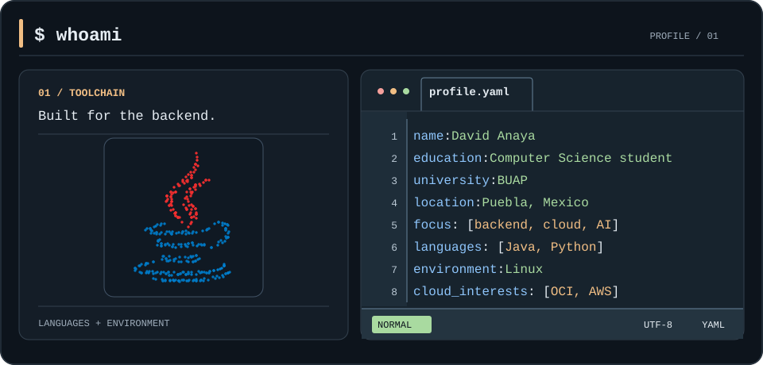

  

<h3 align="center">Computer Science student at the Benemérita Universidad Autónoma de Puebla (BUAP).</h3>

 

 ## About me
 
💻 I'm a 24-year-old developer strengthening my skills through training in programming, software development, innovation, management, and leadership.

🎯My main interests are backend development, cloud computing, and using AI throughout the software development process.

✨ I enjoy learning and building practical, innovative digital solutions that make a positive impact.

## 🚀 **Projects:**

- **Tepexi Digital** — An informational and cultural platform for a municipality in the Mixteca Poblana region.
- **NuevaMente** *(in development)* — An intelligent system for adapting and generating educational content.

## 🤝 Community and Events

I enjoy being part of tech communities and attending events to exchange knowledge, ideas, and experiences.

**Community:**
- AWS Students Builder Group BUAP.

**Events attended:**
- AWS Students Builder Group BUAP.
- AWS Summit Ciudad de México 2026.
- PyDay México 2026.
- Cyber Security Global Congress BUAP 2026.
- FEPRO 2026.

## 🎓  Training & Certifications

- **Training:** Oracle ONE — Backend con Java y Spring Boot.
- **Training:** Programa ONE Tech Foundation G9 - Back End.
- **Earned:** Oracle Cloud Infrastructure 2026 Foundations Associate.
- **Earned:** Oracle Cloud Infrastructure AI Foundations Associate 2026.
- **Preparing for:** AWS Certified Cloud Practitioner.
- **Preparing for:** AWS Certified AI Practitioner.
- **Preparing for:** Oracle Agentic AI Foundations Associate 2026.

## 🛠️ Tech Stack

  <table>
    <thead>
      <tr>
        <th colspan="2" align="left">
          <code>daavid-anaya:~$ cat tech-stack.yaml</code>
        </th>
      </tr>
    </thead>
    <tbody>
      <tr>
        <td width="50%" valign="top">
          <code>├─ ⚙ backend_frameworks:</code>  
           
          <code>Java · Spring Boot · Python · FastAPI</code>
        </td>
        <td width="50%" valign="top">
          <code>├─ ▣ databases:</code>  
           
          <code>MySQL · PostgreSQL</code>
        </td>
      </tr>
      <tr>
        <td valign="top">
          <code>├─ ☁ cloud_infrastructure:</code>  
          <code>Oracle Cloud Infrastructure (OCI)</code>
        </td>
        <td valign="top">
          <code>├─ ◈ frontend_ui:</code>  
           
          <code>HTML · CSS · JavaScript · TypeScript · React · Next.js · Tailwind CSS</code>
        </td>
      </tr>
      <tr>
        <td valign="top">
          <code>├─ ⌘ dev_tools:</code>  
           
          <code>Git · Linux · Docker</code>
        </td>
        <td valign="top">
          <code>╰─ ◇ mobile:</code>  
           
          <code>Dart · Flutter</code>
        </td>
      </tr>
    </tbody>
  </table>

<h2 align="left">📫 Connect with me</h2>

  

  

## 📊 GitHub Stats

  
  

 

